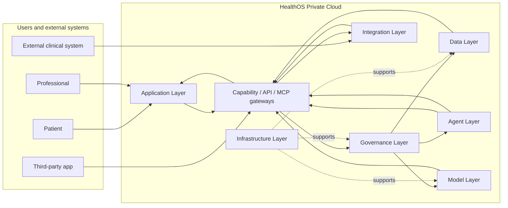
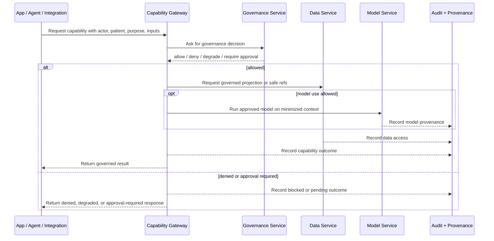
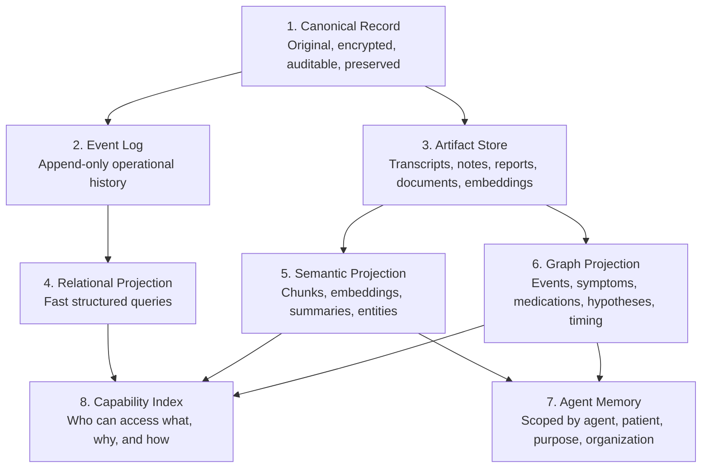
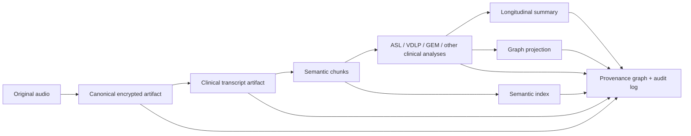
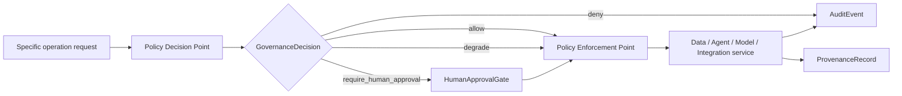
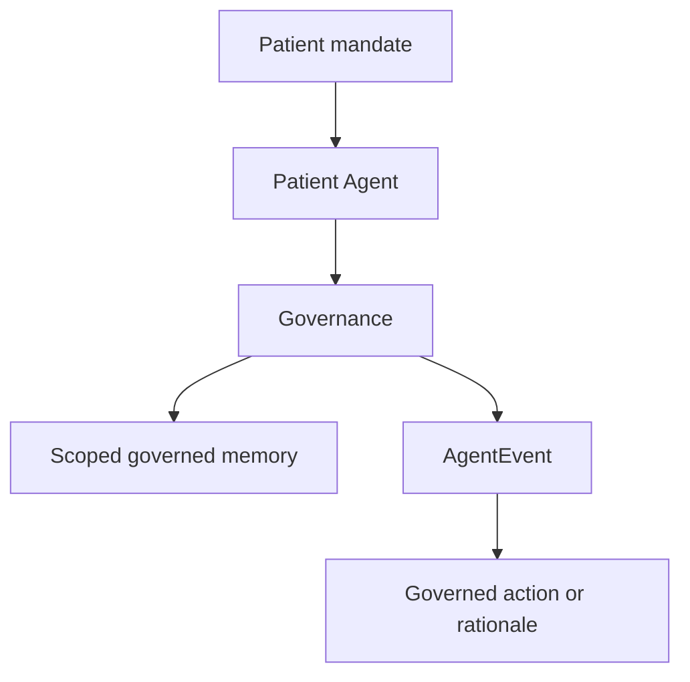
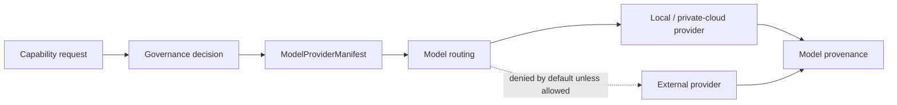

# HealthOS Private Cloud

**Voither PrivateHealthCloud**

HealthOS Private Cloud is a private healthcare cloud infrastructure optimized for Apple Silicon.

It hosts clinical data, agents, AI models, and healthcare applications under native governance for consent, privacy, encryption, auditability, controlled data access, and interoperability.

HealthOS is not an app, not an EHR skin, and not a single-device system. It is a private cloud platform where healthcare applications run on top of governed data and agent infrastructure.

**HealthOS does not require each user to own or operate a Mac. Apple Silicon is the preferred private cloud compute substrate, not the user-facing product.**

This repository is the initial conceptual and contractual scaffold for the platform. It defines language, architecture, contracts, examples, and validation paths. It does not implement a production runtime.

## At A Glance

| Question | Answer |
| --- | --- |
| What is it? | A private healthcare cloud for governed clinical data, agents, models, applications, and integrations. |
| Who is behind it? | Voither can present this repository as Voither PrivateHealthCloud. |
| What is the platform name? | HealthOS Private Cloud. |
| What is Apple Silicon here? | The preferred private cloud compute substrate. |
| What is it not? | Not an app, not an EHR skin, not a UI, not a homelab, not a single-device system, not a finished runtime. |
| Core rule | Apps, agents, models, and integrations access governed capabilities, not raw data. |
| Current status | Conceptual and contractual scaffold only. |

## Central Thesis

Healthcare applications should not own compliance, identity, data custody, model routing, or reidentification logic.

They should run inside a governed private healthcare cloud.

Apps, agents, models, and integrations do not access raw clinical data directly. They access governed capabilities, receive mediated results, and leave audit and provenance trails.

## Product Boundary



HealthOS keeps compliance-sensitive work inside the platform boundary. Applications ask for capabilities. Governance decides. Services enforce. Audit and provenance record what happened.

## Architecture

```mermaid
flowchart TB
  H["HealthOS Private Cloud"]

  H --> I["Infrastructure Layer"]
  H --> D["Data Layer"]
  H --> G["Governance Layer"]
  H --> A["Agent Layer"]
  H --> M["Model Layer"]
  H --> AP["Application Layer"]
  H --> IN["Integration Layer"]

  I --> I1["Apple Silicon compute"]
  I --> I2["Private networking"]
  I --> I3["Encrypted storage"]
  I --> I4["Deployment, observability, backup/restore"]

  D --> D1["Canonical records"]
  D --> D2["Artifacts"]
  D --> D3["Relational, semantic, graph projections"]
  D --> D4["Agent memory and capability index"]

  G --> G1["Consent and purpose"]
  G --> G2["Access policy"]
  G --> G3["Reidentification policy"]
  G --> G4["Audit, provenance, human approval"]

  A --> A1["Patient agents"]
  A --> A2["Professional agents"]
  A --> A3["Workflow, safety, data, integration agents"]

  M --> M1["Local/private model providers"]
  M --> M2["Transcription, embeddings, reranking, LLMs"]
  M --> M3["Remote providers only when allowed"]

  AP --> AP1["Scribe"]
  AP --> AP2["Veridia"]
  AP --> AP3["CloudClinic and future apps"]

  IN --> IN1["APIs and MCP"]
  IN --> IN2["Webhooks and import/export"]
  IN --> IN3["Future FHIR/HL7 connectors"]
```



| Layer | Responsibility | Must Not Do |
| --- | --- | --- |
| Infrastructure | Apple Silicon compute, private networking, encrypted storage, deployment, observability, backup/restore. | Treat hardware as the user-facing product or assume one device per user. |
| Data | Canonical records, artifacts, projections, semantic indexes, graph views, agent memory, capability index. | Expose raw storage as the app integration surface. |
| Governance | Decide allow, deny, degrade, or require human approval for specific operations. | Rely on apps or agents to self-enforce policy. |
| Agent | Execute scoped workflows under mandate, purpose, audit, and review. | Act as unrestricted authorities or raw key custodians. |
| Model | Route governed model work with locality, PHI policy, provenance, and fallback behavior. | Allow direct app calls to model providers. |
| Application | Provide product experiences through declared capabilities. | Own compliance, identity, model routing, or clinical data custody. |
| Integration | Connect internal and external systems through governed interfaces. | Export or import data outside consent and policy scope. |

## Governed Capability Pattern

Apps, agents, models, and integrations do not access clinical data directly. They access governed capabilities.



Example:

```text
App or agent asks:
"I need to summarize this patient's history for this clinical purpose."

HealthOS checks:
- who asked
- which organization or workspace is involved
- which patient is involved
- which purpose is declared
- which consent applies
- which data may be used
- which model may process it
- whether reidentification is allowed
- whether a remote model is allowed
- whether audit, provenance, or human approval is required

HealthOS returns:
a secure, limited, audited, and traceable context.
```

## Data Layer: Multi-Representational By Design

HealthOS does not treat the database as one application-owned store. The Data Layer is multi-representational and AI-native.



**Key rule:** AI does not access the raw clinical record. AI accesses governed projections.



Capability example:

```text
search_patient_context(patientRef, purpose, query)
```

HealthOS decides who is asking, which consent applies, whether reidentification is allowed, whether embeddings or model calls are allowed, what data can leave the Data Layer, and whether human approval is required. Only then does it assemble a safe context.

## Governance Boundary



Every relevant operation must generate or reference a governance decision:

- clinical data read
- artifact write
- reidentification
- export
- model call
- agent call
- external integration use
- document finalization

## Agents

Each patient may have a Patient Agent. The Patient Agent is not just a chatbot and is not a literal custodian of raw cryptographic keys. It operationally represents the patient's mandate, participates in governed access decisions, records events and rationale, requests reidentification only when allowed, and operates under audit and review.



Professional, workflow, safety, data, and integration agents follow the same pattern: mandate, scope, governed context, traceability, and review.

## Models

No application calls a model directly. Model providers are declared by manifest and governed by policy.



Each provider must define runtime, locality, PHI policy, capability profile, versioning, provenance behavior, and fallback behavior. Local and private-cloud providers are preferred for sensitive work. External providers are denied by default unless governance explicitly allows them.

## Applications/Stage

Stages are governed clients of HealthOS. They declare capabilities, requested data classes, outputs, and human approval points. They receive safe references, mediated views, or governed results rather than raw storage access.

## Contracts And Examples

| Area | Contracts |
| --- | --- |
| Data | `PatientRef`, `ArtifactRef`, `DataAccessRequest` |
| Identity | `ActorRef`, `OrganizationRef`, `ServiceIdentity` |
| Consent | `ConsentRecord` |
| Governance | `GovernanceDecision` |
| Agents | `AgentManifest`, `AgentEvent` |
| Models | `ModelProviderManifest` |

## Repository Status

This repository is a conceptual and contractual scaffold. It has no production claims and does not implement a real healthcare runtime, UI, database, cryptography, model execution, clinical workflow, or external integration.

Its purpose is to make the next phase buildable, reviewable, and aligned around governed capabilities, data minimization, privacy, auditability, and interoperability.
